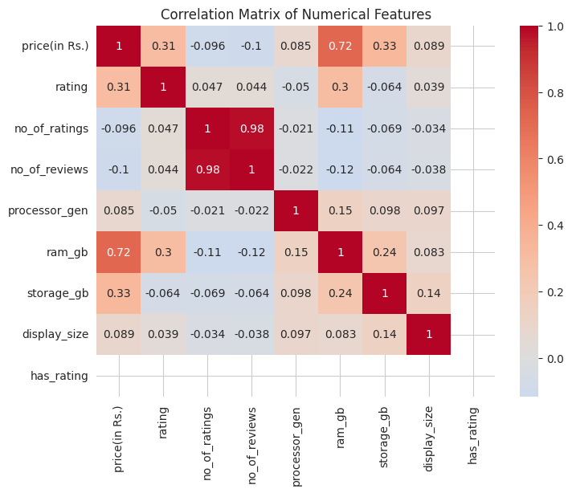
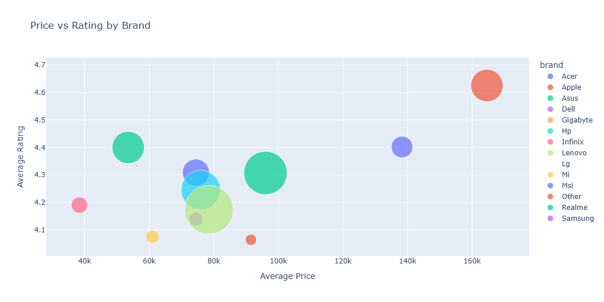
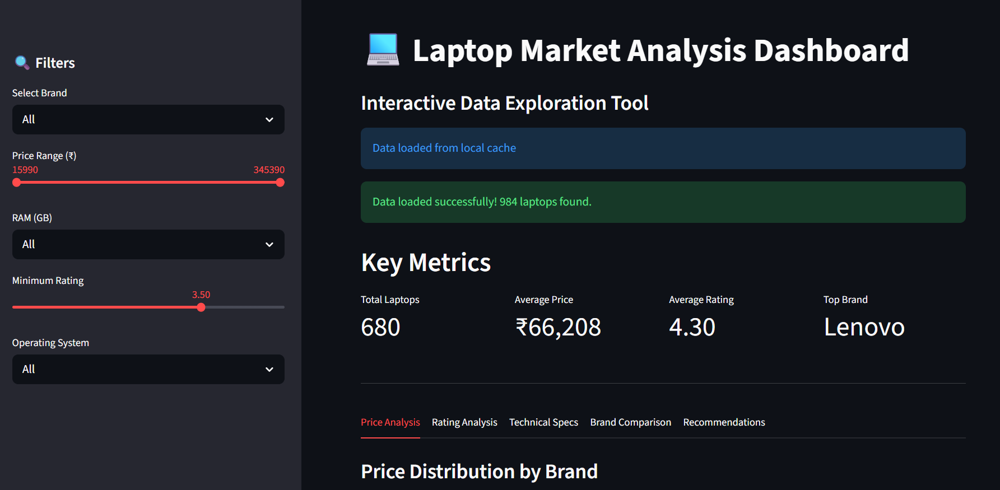

# Laptop Market Analysis

EDA and statistical analysis of the laptop market dataset.

## Project Goal

The goal of this project is to analyze laptop characteristics and identify which factors influence customer ratings.

The analysis includes:
- data cleaning
- feature engineering
- statistical analysis
- outlier detection
- visualization
- correlation analysis
- - **Interactive Streamlit dashboard**

## Dataset

Dataset: Laptop Selection Dataset

The dataset is downloaded automatically using kagglehub in the notebook, and saved locally for the dashboard.

Features:
- laptop brand
- processor
- RAM
- storage
- operating system
- display size
- ratings
- reviews
- price

## Technologies Used

- **Python** 3.12
- **Pandas** - data manipulation
- **NumPy** - numerical operations
- **Matplotlib & Seaborn** - static visualizations
- **SciPy** - statistical tests
- **Plotly** - interactive visualizations
- **Streamlit** - interactive dashboard
- **kagglehub** - data download

## Key Insights

### Hardware Impact on Ratings
- **16 GB RAM** laptops receive significantly higher ratings
- **SSD storage** strongly outperforms HDD
- **AMD processors** show better average ratings than Intel
- **Apple M-series** processors lead in user satisfaction

### Operating Systems
- **macOS** devices have the highest average ratings
- **Windows 11** dominates the market (60% of models)
- **DOS and Chrome OS** receive lower satisfaction scores

### Display Sizes
- **13-14 inch** premium ultrabooks receive highest ratings
- **15.6 inch** is the most common size on the market

### Optimal Mass-Market Configuration
- Windows 11
- Ryzen 5 / Intel i5
- 16 GB RAM
- 512 GB SSD
- 15.6 inch display

## Project Structure

```bash
laptop-market-analysis/
├── README.md
├── requirements.txt
├── src/
│ ├── init.py
│ └── preprocessing.py # Feature extraction & outlier handling
├── notebooks/
│ └── analysis_of_the_laptop_market.ipynb
├── dashboard/
│ └── app.py # Streamlit interactive dashboard
├── data/
│ └── laptops.csv # Cached dataset
└── images/
└── *.png # Exported visualizations
```

## How to Run

### 1. Clone the repository
```bash
git clone https://github.com/valentinashumakova01/laptop-market-analysis.git
cd laptop-market-analysis
```

### 2. Install dependencies
```bash
pip install -r requirements.txt
```

### 3. Run the Jupyter Notebook
```bash
jupyter notebook notebooks/analysis_of_the_laptop_market.ipynb
```

### 4. Run the Streamlit Dashboard
```bash
streamlit run dashboard/app.py
```

## Visualizations

### Correlation Matrix



### Price vs Rating



## Interactive Dashboard Features
- Dynamic filters - Filter by brand, price range, RAM, rating, OS
- Price Analysis - Distribution by brand, price vs rating scatter plot
- Rating Analysis - By brand, processor, RAM
- Technical Specs - RAM, storage, processor, OS distribution
- Brand Comparison - Performance metrics comparison
- Smart Recommendations - Based on market analysis


